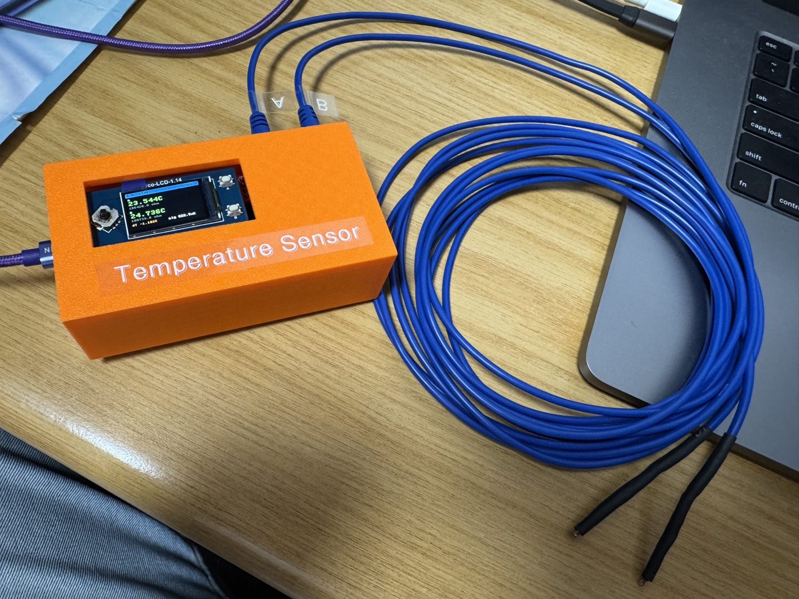
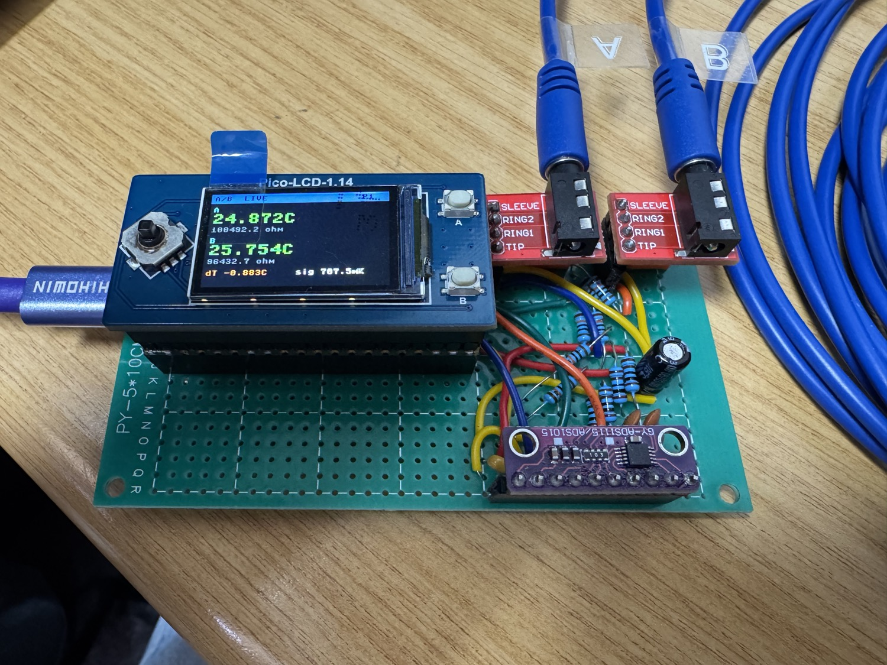
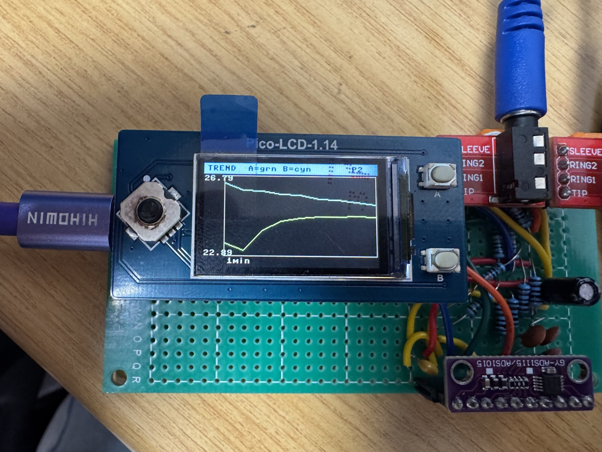
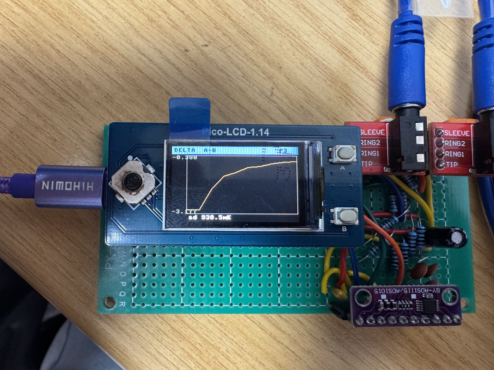
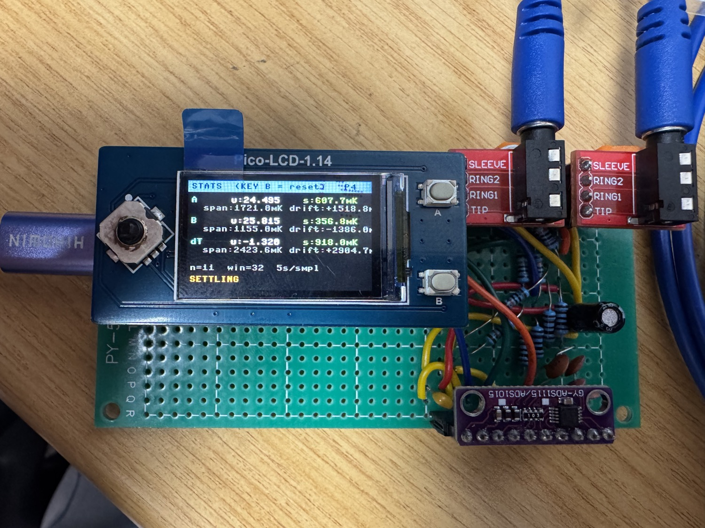

# Precision Thermistor Thermometer

A two-channel, sub-10-millikelvin-class temperature measurement and logging
instrument built around a Raspberry Pi Pico W and a 16-bit ADS1115 ADC, using
matched 100 kΩ NTC thermistors in differential Wheatstone half-bridges.

It was developed as the instrumentation for a passively temperature-stabilised
enclosure used in a photonic reservoir-computing experiment. In that experiment
a multimode fibre acts as the nonlinear mixing medium, and its refractive index
(and therefore the computation it performs) is temperature-sensitive.
Characterising and controlling that thermal environment is what this instrument
is for.

The work is part of a BSc Eng (Electrical Engineering) research project at the
University of the Witwatersrand, supervised by Prof. Mitchell Cox. The research
title is not finalised yet.

> **Status:** working two-channel prototype on soldered stripboard, housed in a
> 3D-printed enclosure. The thermistors are characterised and the live UI is
> complete. The remaining milestone is the rigorous stability (Allan-deviation)
> characterisation. See [Project status](#project-status).



*Pico W and ADS1115 differential front-end with a Pico-LCD-1.14, soldered onto
stripboard, with both NTC probes on shielded cable.*

---

## Why this design

The goal was to find out, cheaply, how much temperature resolution is actually
achievable with a commodity 16-bit ADC before committing to a more complex and
more expensive 24-bit sigma-delta design (the ADS1220). Rather than assume the
24-bit part is necessary, this project proves out the 16-bit approach end to end
and measures its real noise floor.

The design decisions and the reasoning behind them are written up in
[`docs/design_notes.md`](docs/design_notes.md).

---

## How it works

```
            +3V3 (or ADC_VREF)
                 │
     ┌───────────┴───────────┐         (one half-bridge per channel)
     │                       │
    R_a (100k)              R_top (100k)
     │                       │
   NODE_A ───► AINP        NODE_B ───► AINN     ADS1115 reads (AINP − AINN)
     │                       │                  differentially, PGA-amplified
    R_b (100k)              NTC (100k, on cable)
     │                       │
    GND                     GND
```

* Each thermistor sits in its own differential half-bridge. The bridge output
  is about 0 V at balance (around 25 °C), so the ADC's smallest range
  (±0.256 V, PGA = 16) can be used for maximum resolution around the operating
  point.
* The ADS1115 has two differential pairs, so two probes are read: channel 1 is
  AIN0−AIN1 and channel 2 is AIN2−AIN3.
* Resistance is recovered from the measured differential voltage and then
  converted to temperature with a narrow-range B-model fit (see
  [Calibration](#calibration)).
* A Waveshare Pico-LCD-1.14 provides a multi-page live UI. Readings also stream
  as CSV over USB serial for logging.

### Resolution (theoretical)

| Quantity | Value |
|---|---|
| Bridge sensitivity (V_exc = 3.3 V) | ≈ 36.6 mV/K |
| ADS1115 LSB at PGA = 16 (±0.256 V) | 7.81 µV |
| **Resolution** | **≈ 0.21 mK / LSB** |
| Usable span at PGA = 16 | ≈ ±7 K around bridge balance |

These figures are derived and verified by round-trip simulation in
[`docs/design_notes.md`](docs/design_notes.md). The full error budget, which
separates the theoretical precision (tens of µK) from the reference-limited
absolute accuracy (about 0.1 °C), is in
[`docs/error_budget.md`](docs/error_budget.md).

---

## Measured performance

> Numbers marked _(prelim.)_ are early bench observations rather than a rigorous
> characterisation. The formal stability campaign is the next milestone.

| Metric | Value | Notes |
|---|---|---|
| Single-shot noise, settled (breadboard) | ~±4 mK p-p _(prelim., eyeballed)_ | continuous excitation, no RC filter |
| Rolling σ (32-sample), simulated 3 mK input | ~2.4 mK | sanity check of stats pipeline |
| Thermistor B-value match (A vs B) | 0.1 % | 3816.6 K vs 3820.8 K |
| Thermistor R₀ match (A vs B) | 0.3 % | ~99.9 kΩ vs ~99.6 kΩ at 25 °C |
| Absolute accuracy | ~0.1 °C | limited by reference probe (UNI-T UT71B) |
| **Stability / Allan deviation (Veroboard)** | not yet measured | formal logged campaign pending |

A note on accuracy versus precision. The ~0.1 °C absolute figure is set by the
reference thermometer used during calibration. The instrument's relative
stability, which is the quantity that matters for thermal control, is far
better, and that is what the Allan-deviation campaign will quantify.

---

## Repository layout

```
precision-thermistor-thermometer/
├── README.md                 ← this file
├── LICENSE
├── firmware/                 ← MicroPython for the Pico W
│   ├── config.py             ← all tunable constants (QUIET/FAST profiles, calibration)
│   ├── ads1115.py            ← minimal differential ADS1115 driver
│   ├── bridge.py             ← bridge maths + B-model / Steinhart-Hart
│   ├── sampling.py           ← runtime QUIET/FAST sampling-profile switch
│   ├── ds18b20_reader.py     ← optional 1-Wire ambient sensor
│   ├── lcd_1inch14.py        ← Waveshare Pico-LCD-1.14 driver (bundled)
│   ├── display.py            ← multi-page LCD UI (KEY A/B navigated)
│   └── main.py               ← measurement loop (USB + flash CSV logging)
├── hardware/
│   ├── ADS1115BasicDesign.*  ← KiCad schematic + BOM (draws an optional DS18B20 not fitted here)
│   ├── schematic_bridge.png  ← bridge + ADC front-end
│   ├── netlist.md            ← full from-to netlist
│   └── bom.md                ← bill of materials
├── docs/
│   ├── user_manual.md        ← how to run the device (screens, buttons, output)
│   ├── design_notes.md       ← design rationale + noise budget
│   ├── error_budget.md       ← theoretical accuracy vs precision, full budget
│   ├── calibration_procedure.md ← how to calibrate and match the two channels
│   ├── characterisation.md   ← thermistor calibration write-up
│   ├── calibration/          ← raw (T,R) sweep, fit spreadsheet, residuals plot
│   └── build_log.md          ← chronological bring-up / debugging notes
├── tools/
│   ├── serial_logger.py      ← capture the USB CSV stream to a host file (+ live plot)
│   ├── analyse_log.py        ← off-Pico stability / Allan-deviation analysis
│   └── requirements.txt      ← host-side Python dependencies
├── enclosure/                ← 3D-printed cover (Fusion 360 + STEP + STL)
│   ├── cover.f3d
│   ├── cover.step
│   └── cover.stl
├── data/                     ← logged runs (CSV)
└── images/                   ← photos, screenshots
```

---

## Quick start

1. Flash MicroPython for the Pico W (the `.uf2` from micropython.org).
2. Copy everything in [`firmware/`](firmware/) to the Pico's root. The Waveshare
   `lcd_1inch14.py` driver is bundled, so nothing else needs downloading. Thonny
   works, but `mpremote` copies the whole folder in one go
   (`mpremote connect auto cp firmware/*.py :` then `mpremote reset`), and
   `mpremote mount firmware` runs the code straight off your computer while you
   develop, with no copying.
3. Edit [`firmware/config.py`](firmware/config.py): set your measured excitation
   voltage, per-channel resistor values, and thermistor coefficients. Choose a
   boot `MODE`. `'logging'` starts in the quiet, roughly 1 mK QUIET profile and
   `'live'` starts in the fast FAST profile. You can switch between them at any
   time by long-pressing the joystick (see [Sampling profiles](#sampling-profiles)).
4. Reset the Pico. `main.py` runs automatically. Readings appear on the LCD,
   stream as CSV over USB serial, and, when `LOG_TO_FLASH` is set, are appended
   to `log.csv` on the Pico's flash so a run survives a USB disconnect.
5. Capture a run live on the computer with
   [`tools/serial_logger.py`](tools/serial_logger.py), or pull `log.csv` off the
   Pico's flash. Then analyse stability with
   [`tools/analyse_log.py`](tools/analyse_log.py) (see
   [Logging and analysis](#logging-and-analysis)).

The chronological bring-up, including the debugging dead-ends, is in
[`docs/build_log.md`](docs/build_log.md).

---

## The display

New to the device? The [user manual](docs/user_manual.md) walks through the
screens, the buttons, the update cadence, and how to read the data on a
connected computer.

Five pages, moved through with **KEY A** (next) and **KEY B** (previous). The
joystick LEFT / RIGHT pages too, as a backup.

| Page | Shows |
|---|---|
| **LIVE** | Both probes in large type: temperature, resistance, ΔT, rolling σ |
| **AVERAGES** | Rolling mean over a short and a long window, per probe, plus A−B |
| **TREND** | Scrolling chart of A and B temperature (shared autoscale) |
| **DELTA** | Scrolling chart of A−B (common-mode-cancelled, most sensitive) |
| **STATS** | Mean, σ, min-max span, drift rate, STABLE/SETTLING flag |

The rest of the controls sit on the joystick. UP cycles the backlight (full,
dim, off), which matters because the backlight is a heat source near the
sensors. DOWN resets the statistics and history. A short press of the joystick
centre toggles a hold/freeze, and a long press switches the sampling profile
live (see [Sampling profiles](#sampling-profiles)).

<p align="center">
  
  
  
  
</p>

*The LIVE, TREND, DELTA and STATS pages on the Pico-LCD-1.14. The on-screen text
was enlarged and an AVERAGES page added after these photos were taken.*

## Sampling profiles

The instrument carries two sampling profiles and switches between them at
runtime, with no reflash, by long-pressing the joystick centre. A FAST badge
shows in the header when the fast profile is active.

| Profile | Averages | Rate | PGA | Cycle | For |
|---|---|---|---|---|---|
| **QUIET** | 16 | 8 SPS | ±0.256 V | 5 s | the quiet, roughly 1 mK logging setup |
| **FAST** | 4 | 475 SPS | ±2.048 V | 0.2 s (≈5 Hz) | watching the screen in near real time |

`config.MODE` chooses which one is active at boot. Both profiles are defined in
[`firmware/config.py`](firmware/config.py), so the averages, rate, range, cycle
time, and settle wait of either can be tuned there. To go faster than 5 Hz, lower
the FAST `period_s` toward about 0.1.

---

## Logging and analysis

Each cycle the firmware emits one CSV row, both over USB serial and, when
`LOG_TO_FLASH` is set, appended to `log.csv` on the Pico's flash. The columns
are:

```
cycle, t_s, vdiff1_uv, r1_ohm, t1_c, vdiff2_uv, r2_ohm, t2_c, t_amb_c
```

The serial stream is the easy way to capture a run straight onto the connected
computer in real time. `serial_logger.py` auto-detects the Pico's port, saves a
timestamped file under `data/`, appends a `host_time` wall-clock column to each
row so the data lines up with other measurements, and can draw a live chart:

```
python tools/serial_logger.py            # capture to data/, echo to screen
python tools/serial_logger.py --plot     # also show a live temperature chart
```

The flash log is the backup that survives a USB disconnect. Either way, copy the
resulting CSV onto a computer and run the off-Pico analysis tool:

```
python tools/analyse_log.py log.csv --settle-min 10
```

It prints per-channel statistics (mean, σ, peak-to-peak, drift), the
common-mode-cancelled A−B difference channel, and an overlapping Allan deviation
against averaging time τ. The minimum of the Allan curve is the headline number
for this project. It gives the best achievable stability and the averaging time
that reaches it, which is the direct answer to the question "is 16-bit enough?".
The tool needs `numpy` and `matplotlib`.

---

## Calibration

Thermistors are characterised individually against a UNI-T UT71B reference and
then fitted with a two-parameter B-model tuned for the 10–30 °C operating range:

```
T(°C) = B / (ln R − intercept) − 273.15
```

| Probe | B (K) | intercept | R₀ @ 25 °C |
|---|---|---|---|
| A (NTC-01) | 3816.56 | −1.288504 | ~99.9 kΩ |
| B (NTC-02) | 3820.82 | −1.306170 | ~99.6 kΩ |

For relative precision you usually do not need that absolute calibration, or a
reference thermometer at all. You only need the two channels to agree when both
probes are at the same temperature. Bond the probe beads together, let them
settle, read the steady A−B on the AVERAGES screen, and set the per-channel
`CH1_T_OFFSET` / `CH2_T_OFFSET` trims to zero it. The full step-by-step is in
[`docs/calibration_procedure.md`](docs/calibration_procedure.md).

The absolute method, residuals, and raw sweep data are in
[`docs/characterisation.md`](docs/characterisation.md) and
[`docs/calibration/`](docs/calibration/) (fit workbook
`V2_Thermistor_Measurement.xlsx`).

---

## Project status

- [x] Differential bridge + ADS1115 front-end designed and simulated
- [x] Single-channel bring-up on breadboard
- [x] Two-channel (Option C) differential operation
- [x] Thermistor characterisation (B-model)
- [x] Soldered onto stripboard with RC input filters + star ground
- [x] Multi-page LCD UI
- [x] On-Pico flash logging + off-Pico Allan-deviation analysis tool
- [x] 3D-printed enclosure modelled and printed (fit being refined)
- [ ] Formal stability / Allan-deviation campaign (breadboard vs soldered)
- [ ] Decision: is 16-bit sufficient, or move to the ADS1220?

---

## License

MIT. See [LICENSE](LICENSE).

## Acknowledgements

Built at the University of the Witwatersrand as part of a BSc Eng (Electrical
Engineering) project supervised by Prof. Mitchell Cox, as the instrumentation
for a photonic reservoir-computing experiment. The 3D-printed enclosure was
designed by Matthew Maccelari. The firmware and circuit were developed
iteratively on the bench. See [`docs/build_log.md`](docs/build_log.md) for the
full bring-up story, including the debugging dead-ends.
