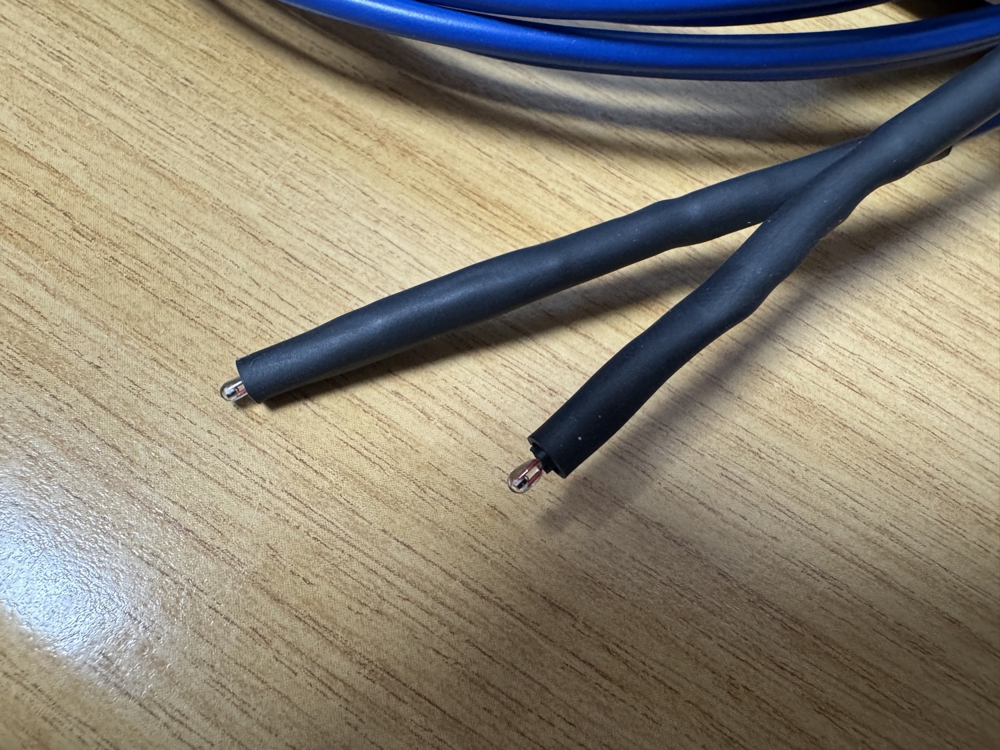

# Build log

Chronological bring-up, including the debugging dead-ends. They are kept because
they are the most useful part for anyone reproducing the work.

## 1. Front-end design

Differential half-bridge per probe, ADS1115 at PGA = 16 for 0.21 mK/LSB. Bridge
maths and resolution were verified by round-trip simulation before any hardware.

## 2. Single-channel breadboard bring-up

* First run with nothing wired: I²C scan empty, as expected. Added a
  wait-for-ADC loop so a missing board no longer crashes the session.
* With the ADS1115 wired, `0x48` was found and the self-check ran.
* **Dead-end #1: readings pinned at 100 kΩ, not tracking.** The thermistor's
  resistance changed at the jack but not in the readings. The cause was that the
  diagnostic script read the AIN0-AIN1 pair while the bridge was wired to
  AIN2-AIN3. The ADS1115 has two differential pairs and the MUX bits select
  between them. The fix was to point the MUX at the correct pair. Differential
  mode had been correct all along, it was just the wrong pair.
* After the fix the resistance tracked a finger-pinch up and down correctly. The
  front-end was proven.

## 3. Connectors

TRS audio jacks are used as thermistor connectors (Tip = sense node, Ring = GND,
Sleeve = shield grounded at the board end only). The thin inner conductors of
aux cable are enamelled, so they must be tinned or scraped before they make
contact. This initially looked like a broken cable.

## 4. Two-channel (Option C)

Both probes on independent differential pairs: CH1 = AIN0−AIN1,
CH2 = AIN2−AIN3. Thermistor A goes to CH1 and B goes to CH2, so each matches its
calibration coefficients.

## 5. Pulsed excitation attempt (abandoned)

* Built a high-side PMOS switch on the excitation rail.
* **Dead-end #2: bridge dead with the PMOS in circuit.** Drain stuck at 0 V. The
  gate measured swinging 3.3 V to 1.6 V and never reached 0 V. The cause was
  that the two-resistor gate "drive" was actually a passive divider that floats
  the gate to its midpoint, so it cannot pull a high-side PMOS gate to 0 V.
* Switched to direct GPIO gate drive (active-low). The gate then swung fully and
  the PMOS conducted.
* The catch was that the only available PMOS was an IRFD9024, a
  standard-threshold part. At −3.3 V V_GS it only partially enhances, dropping
  about 0.38 V with a temperature-dependent resistance. The decision was to
  remove the switch and run continuous excitation. Self-heating then becomes a
  constant, calibrated-out offset, which is cleaner than a drifting switch.
  Pulsing can return later with a logic-level PMOS.

## 6. Thermistor characterisation

UT71B sweep, B-model fit for the 10 to 30 °C operating range. Coefficients were
entered in config and the firmware conversion was verified against the fit's own
predictions.

## 7. Soldered to stripboard

* Added RC input filters and star grounding.
* **Dead-end #3: huge readings after soldering.** The self-check showed Vdiff of
  about −1.59 V on both channels, where it should be tens of mV. A software
  sign-invert turned it positive but the magnitude stayed at about 1.59 V, so
  the real fault was not a sign swap but a node sitting near a rail (a mis-wired
  or open input on the soldered board, found by measuring each AIN pin to GND).
  The lesson is that a large differential means a node is not at a divider
  midpoint, so measure the pins before touching firmware.

## 8. Multi-page UI

LIVE, TREND, DELTA and STATS pages, joystick navigation, backlight control,
rolling σ and drift, and a STABLE/SETTLING flag. The logic was verified in a
desktop simulation with mocked hardware.

## 9. UI and host-logging rework

* **Dead-end #4: paging felt unreliable.** The display module had at some point
  been pasted into its own file twice. Python kept the second copy, and that copy
  navigated only with the joystick LEFT and RIGHT, which are the least dependable
  inputs on the HAT. Removing the duplicate and moving paging onto the two
  physical keys (KEY A next, KEY B previous, joystick LEFT and RIGHT as a backup)
  fixed it.
* Enlarged the on-screen text and re-laid-out every page so nothing overlaps,
  after spotting the rolling σ field colliding with the cycle counter and the
  STATS span and drift line running off the right edge.
* Added an AVERAGES page (rolling mean over a short and a long window per probe)
  and a runtime QUIET/FAST sampling switch on a long-press of the joystick
  centre, so the sampling cadence can change without a reflash.
* Added `tools/serial_logger.py` to capture the USB CSV stream straight onto the
  host computer. The page layouts and the button logic were checked in desktop
  simulations with mocked hardware before flashing.

## 10. Channel matching and first Allan deviation

Both beads were bonded and logged in a temperature-controlled box. Both probes
followed the box drift together (about 190 mK, agreeing to within 4 mK), so the
A−B difference sat flat at +133.5 mK. That offset was split between the two
channels (`CH1_T_OFFSET`, `CH2_T_OFFSET`) to bring A−B to within 0.1 mK. The same
run gave the first overlapping Allan deviation: each channel alone is
drift-limited, but A−B stays sub-millikelvin (about 0.5 to 0.8 mK), which is the
common-mode rejection the differential bridge was built for. Full write-up in
[`calibration/calibration_run_results.md`](calibration/calibration_run_results.md).

## Outcome

The bonded-probe run answered the central question: a commodity 16-bit ADS1115 in
a matched differential bridge resolves temperature differences at the
sub-millikelvin level, so the more expensive 24-bit ADS1220 is not needed for this
application. The absolute single-channel stability is bounded by the thermal
environment rather than the ADC, and characterising it further would need a more
stable reference than was available. Possible extensions are in the README's
future-improvements section.
