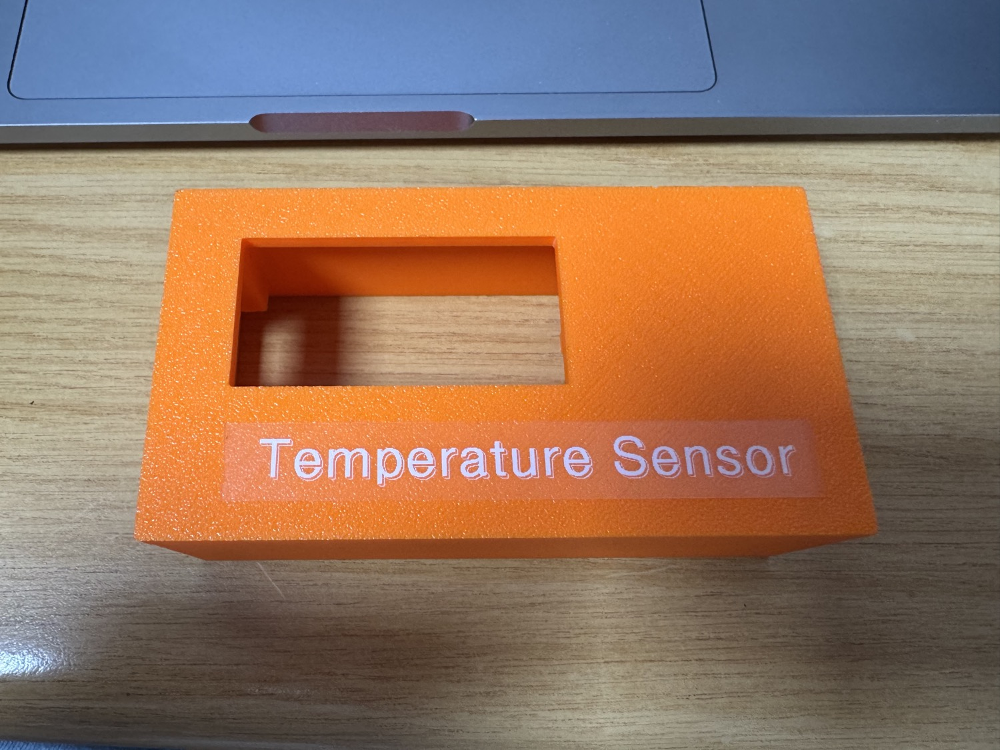
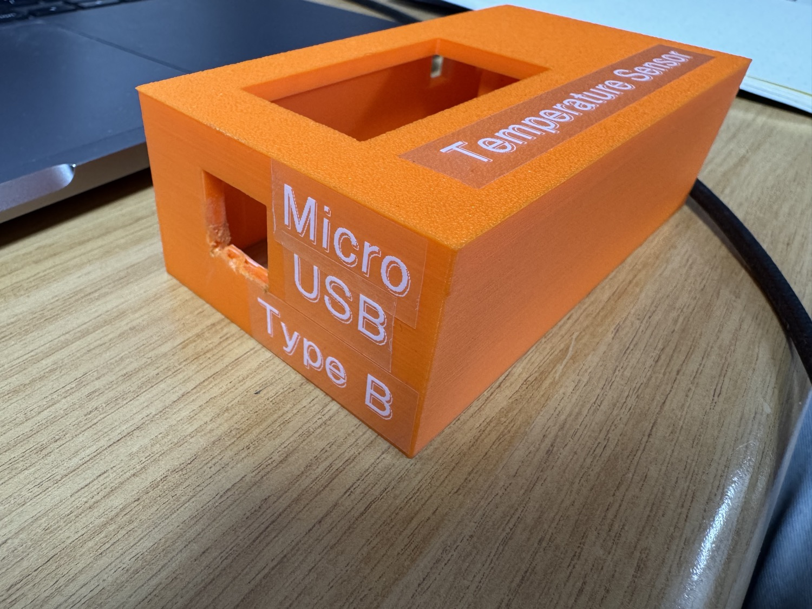
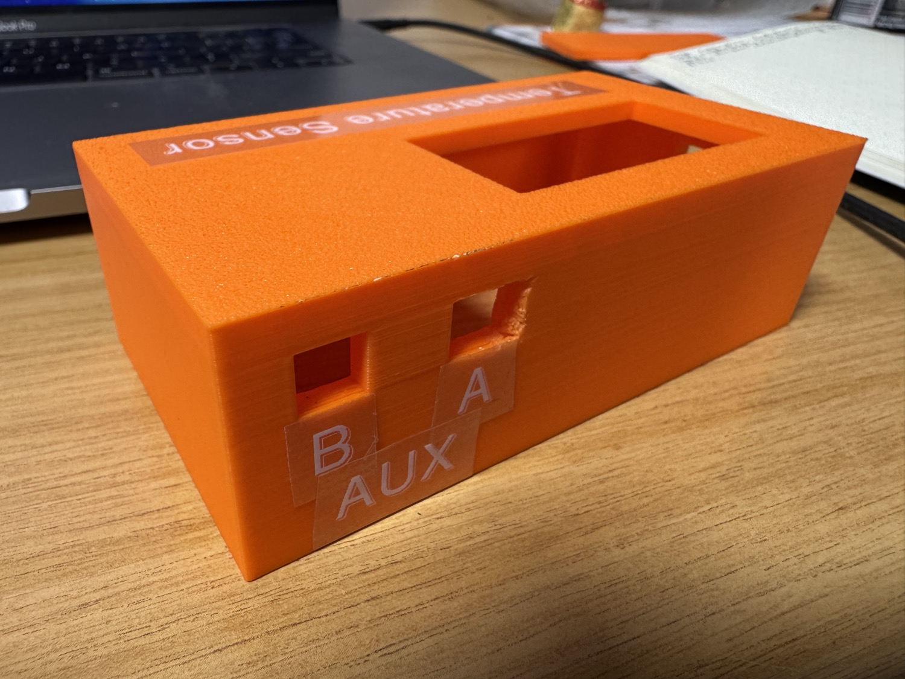
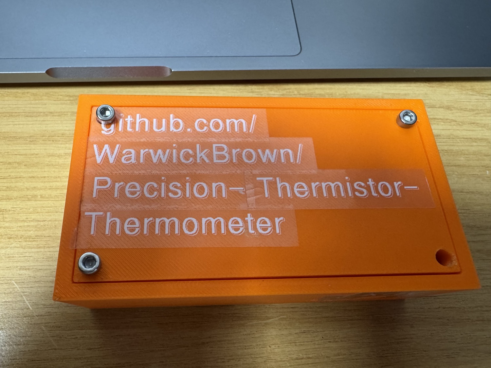

# Enclosure

3D-printed cover for the instrument (Pico + LCD + stripboard), designed by
**Matthew Maccelari**.

Source CAD and meshes:

| File | Format |
|---|---|
| `cover.f3d` | Fusion 360 source |
| `cover.step` | portable STEP solid (for other CAD tools) |
| `cover.stl` | mesh, ready to slice and print |

  
  
  

*USB side, the labelled A / B AUX jacks, and the engraved base.*

## Note

The 3D print is not perfect and adjustments need to be manually made to the hole sizes when fitting the circuit board into the enclosure.

M3 10mm hole inserts should be sunk into the plastic and M3 20mm bolts can be used to screw it all down.

## Design considerations

- **LCD on the lid**, board inside, which keeps the screen visible while the
  sensors stay enclosed.
- **Backlight heat:** the LCD backlight is the largest local heat source. Keep
  it physically away from the thermistor cable entries, and note the firmware
  can dim/disable the backlight (KEY A) during sensitive runs.
- **Cable pass-throughs** for the two thermistor leads (audio jacks) and USB.
- **Non-enclosed reference-resistor cluster** sits with the warm digital
  section, because thermal gradients across the bridge resistors appear as
  measurement error.
- **Female AUX daughter board supports** have been added so that the small boards do not flex. Glue the blocks onto the Veroboard and Prestik them to the top so the boards don't move. A support has been added behind the boards to support the insert force.
